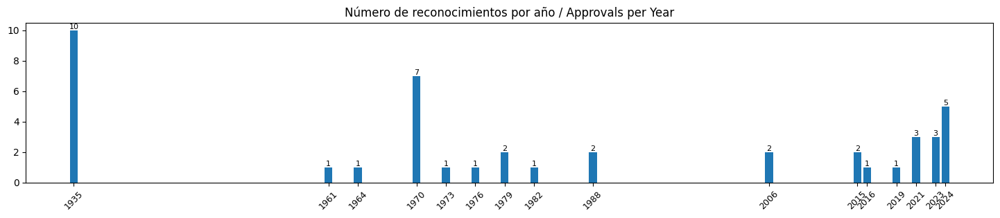

# Cráteres lunares nombrados en honor a mujeres / Moon Craters Named after Women

[+Ampliar/Zoom](women_craters_moon_map.png)

## Conjunto de datos / Dataset
> [women_moon_craters.csv](https://github.com/sergio-dr/women_moon_craters/blob/main/women_moon_craters.csv)
>
> Columnas/Fields:
> * `crater`: nombre del cráter / name of the crater
> * `diam`: diámetro [km] / diameter [km]
> * `lat`: latitud selenográfica central [º] / center selenographic latitude [deg]
> * `lon`: longitud selenográfica central [º] / center selenographic longitude [deg]
> * `approval_date`: fecha de aprobación / approval date 
> * `nombre`: nombre en español / name in spanish
> * `origin`: breve reseña histórica / brief historical info
> 

Este conjunto de datos se ha elaborado filtrando la base de datos completa de cráteres del [sitio web de Nomenclatura Planetaria del USGS](https://planetarynames.wr.usgs.gov) con una lista de cráteres con nombre de mujer recopilada manualmente a partir de varias fuentes (ver referencias más abajo) y completada revisando cuidadosamente las [Noticias de Nomenclatura del USGS](https://planetarynames.wr.usgs.gov/News) en busca de aprobaciones recientes. Intentaremos mantener la lista actualizada visitando este sitio periódicamente. No dude en contribuir abriendo un *issue* si encuentra algún error u omisión.

This dataset was produced by filtering the full crater database from the [USGS Planetary Nomenclature site](https://planetarynames.wr.usgs.gov) with a list of women-named craters manually collected from several sources (see references below) and completed by carefully reviewing the [Nomenclature News from USGS](https://planetarynames.wr.usgs.gov/News) for recent approvals. We'll try to keep the list up to date by revisiting this site periodically. Please feel free to contribute by opening an issue if you find any error or omission.

## Hechos / Facts

## Licencia / License
CC-BY Francisco Vega, Sergio Díaz

## Créditos / Data credit
* [USGS Planetary Nomenclature - Moon Craters](https://planetarynames.wr.usgs.gov/SearchResults?Target=16_Moon&Feature%20Type=9_Crater,%20craters)
* [NASA Scientific Visualization Studio CGI Moon Kit](https://svs.gsfc.nasa.gov/4720/)

## Otras referencias / References
* Daniel R. Altschuler, Fernando J. Ballesteros. *Las mujeres de la Luna: Historias de ciencia, amor, dolor y valor*. Next Door Publishers, 2019.
* Vicente Toledo. [La Luna tiene nombre de mujer](https://portal.edu.gva.es/blogs/s1/vicentetoledotolsada/la-luna-tiene-nombre-de-mujer/). 2023.
